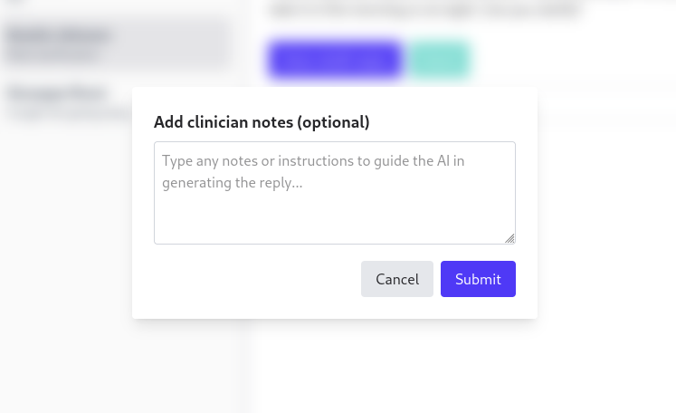
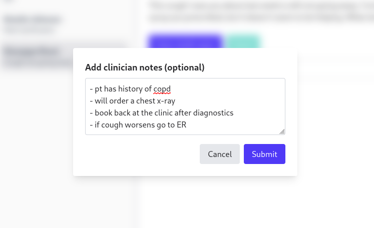
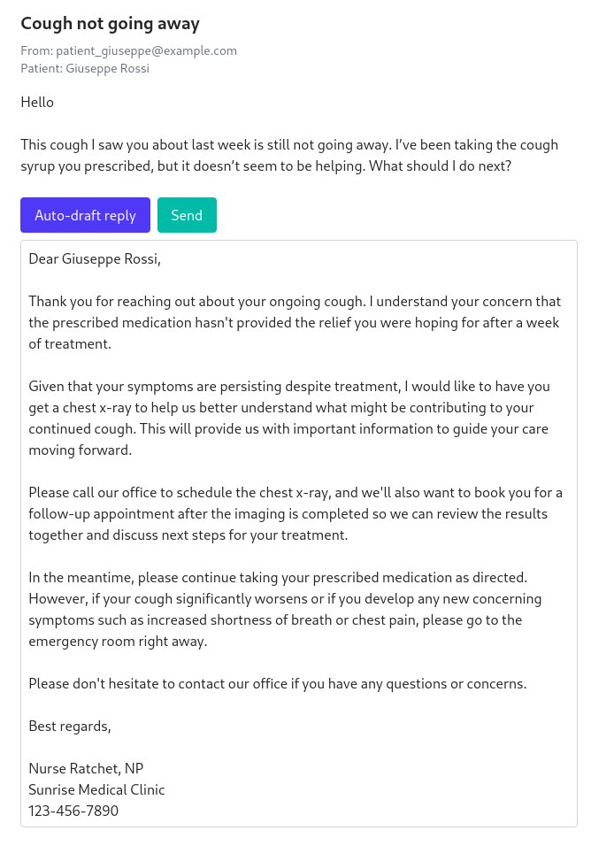

# Email Assistant

A full-stack application prototype for email with AI-assisted draft replies.

## Getting Started

### Prerequisites
1. Python 3.11
2. Node 20+
3. An Anthropic API key (or a willingness to modify the backend to call another service)

### Installing Dependencies

For the **backend stack**:
```bash
cd backend
pip install -r requirements.txt
cd ..
```

For the **frontend stack**:
```bash
cd frontend
npm install
cd ..
```

### Running the Application

Run the backend with:
```bash
uvicorn backend.app.main:app --reload
```

and the frontend with:
```bash
cd frontend
npm run dev
```

The app should now be served at [http://localhost:5173](http://localhost:5173)

### Testing

To run backend unit tests:
```bash
pytest
```

## Using the AI generated replies

When selecting the "Auto-draft reply" button on an email, you will see a modal appear. 



If you want the AI to draft the reply on its own, simply hit submit. You can optionally type short-form notes to help guide the AI in generating a reply if you have a specific message you want to convey.



This will result in an auto-generated reply draft that incorporates the clinician notes.

